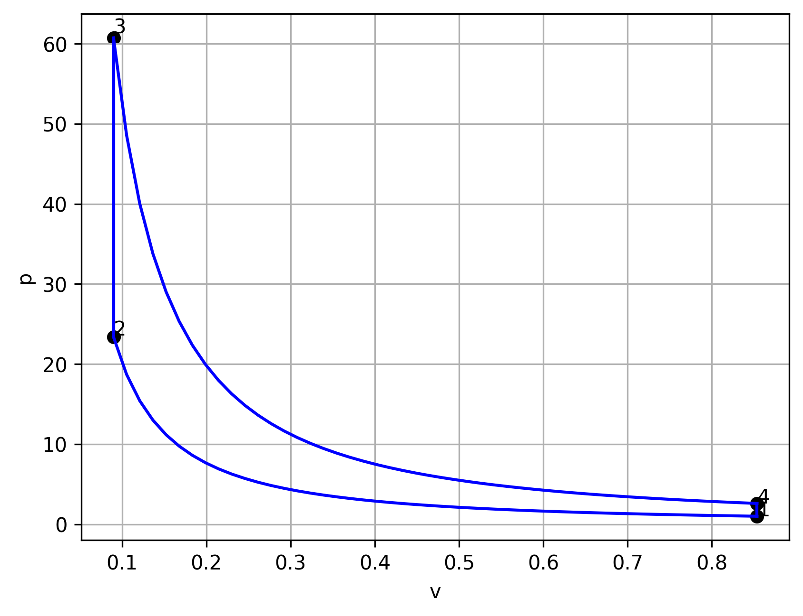

# Thermodynamic Cycles

## States values

| States | s [kJ/kgK] | P [bar] | T [K]  | $\theta\ [ ^\circ C ]$ | x [--]                    | h [kJ]   |
| ------ | ---------- | ------- | ------ | ---------------------- | ------------------------- | -------- |
| 1      | 1.434      | 1.5     | 384.5  | 111.35                 | 0.0 : Saturated Liquid    | 467.081  |
| a      | 1.434      | 10.0    | 384.57 | 111.42                 | -0.146 : Subcooled Liquid | 467.991  |
| b      | 2.138      | 10.0    | 453.04 | 179.89                 | 0.0 : Saturated Liquid    | 762.683  |
| c      | 2.138      | 30.0    | 453.32 | 180.17                 | -0.136 : Subcooled Liquid | 764.934  |
| 3      | 2.646      | 30.0    | 507.01 | 233.86                 | 0.0 : Saturated Liquid    | 1008.371 |
| 4      | 6.186      | 30.0    | 507.01 | 233.86                 | 1.0 : Saturated Steam     | 2803.265 |
| 5      | 6.585      | 30.0    | 583.21 | 310.06                 | 1.121 : Superheated Steam | 3019.653 |
| 6      | 6.638      | 10.0    | 462.31 | 189.16                 | 1.012 : Superheated Steam | 2801.372 |
| 7      | 7.162      | 10.0    | 583.21 | 310.06                 | 1.147 : Superheated Steam | 3073.203 |
| 8      | 7.297      | 1.5     | 398.31 | 125.16                 | 1.013 : Superheated Steam | 2722.105 |

## Processes values

| Process | Type      | q [kJ/kg]    | wt [kJ/kg]   | w [kJ/kg]    |
| ------- | --------- | ------------ | ------------ | ------------ |
| 1--a    | Adiabatic | 0.00000e+00  | -7.95507e-01 | -8.73706e-04 |
| a--b    | Isobaric  | 0.00000e+00  | 0.00000e+00  | 0.00000e+00  |
| b--c    | Adiabatic | 0.00000e+00  | -2.25090e+00 | -1.00000e-03 |
| c--3    | Isobaric  | 2.43438e+02  | 0.00000e+00  | -1.00000e-03 |
| 3--4    | Isobaric  | 1.79489e+03  | 0.00000e+00  | -1.00000e-03 |
| 4--5    | Isobaric  | 2.16388e+02  | 0.00000e+00  | -1.00000e-03 |
| 5--6    | Adiabatic | 0.00000e+00  | 2.18281e+02  | -1.00000e-03 |
| 6--7    | Isobaric  | 2.37500e+02  | 0.00000e+00  | -8.73706e-04 |
| 7--8    | Adiabatic | 0.00000e+00  | 3.06756e+02  | -8.73706e-04 |
| 8--1    | Isobaric  | -1.97023e+03 | 0.00000e+00  | -8.73706e-04 |

Python code to construct thermodynamic cycles. Create several diagrams (T-s, h-s, P-v e.t.c.) and calculate state and processes variables such as temperature, entropy, work e.t.c.. Save all the above to .png and .csv files correspondingly. It works for the following working fluids:

- Ideal gas,

- Van der Walls fluid and 

- Two Phase fluid.

### Ideal gas.

Implementation of the ideal gas formulations for Isobaric, Isochoric and Isentropical processes.The others types of processes are to be made.

### Van der Walls gas.

Solving the Van der Walls equation numericaly using Newtons method. Works for Isobaric and Isothermal processes. The others types of processes are to be made.

### Two Phase gas.

Using @CoolProp library to calculate system variables. Works for Isobaric and Adiabatic processes. The others types of processes are to be made.

_Future improvements are to comment the code and make it work for all types of processes._
